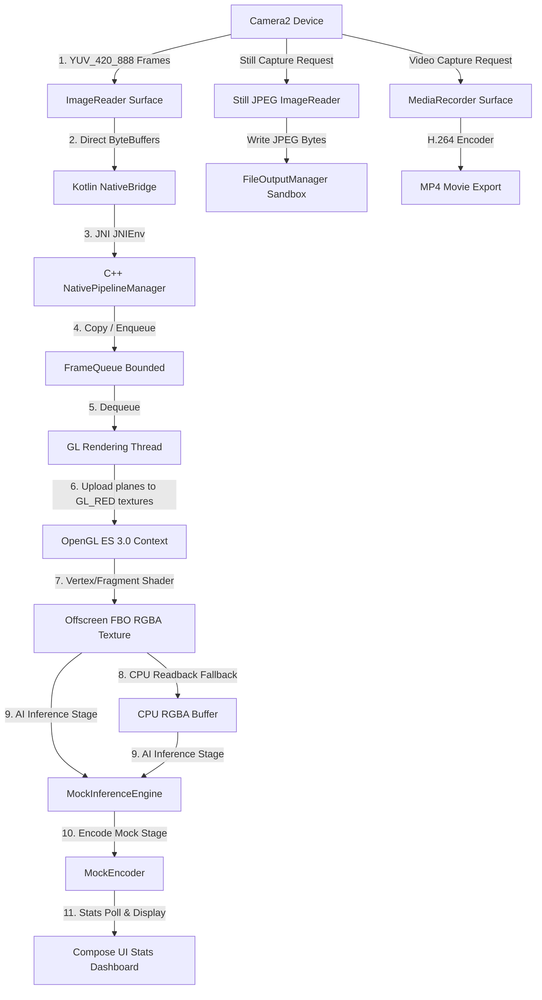

# Real-time AI Camera NDK Pipeline Demo App

This project demonstrates a production-minded, real-time camera processing pipeline on Android using **Camera2 API** and a native **C++ JNI/NDK** pipeline accelerated by **OpenGL ES 3.0** on the GPU.

---

## Architecture Diagram

---

## Key Architecture Design Details

### 1. Why Camera2 instead of CameraX?
Camera2 API provides low-level control over outputs, frame rates, plane metadata, and multi-surface session layouts, making it easier to integrate directly with C++ JNI/NDK graphics APIs.

In Camera2, all surfaces intended for future requests (such as preview, processing ImageReader, still ImageReader, and video encoder) must be included during the session creation. Simultaneous stream configurations are subject to hardware constraints, and dynamic surface additions require recreating the session.

### 2. Native C++ Frame Processing Pipeline
Most frame handling is implemented in C++ because real-world AI and computer vision solutions (such as OpenCV, TensorFlow Lite, ONNX Runtime, and custom vendor SDKs) are provided as native libraries.

By using Kotlin solely for UI, lifecycle, and session control, and delegates to C++:
* **FrameQueue**: Thread-safe bounded concurrent queue with backpressure policies (`DROP_OLDEST` and `DROP_LATEST`).
* **GPU uploads and conversions**: Executed on a dedicated background native rendering thread (`GlThread`) using a shared EGL context.

### 3. GPU-Based YUV to RGB Conversion (OpenGL ES 3.0 / EGL)
CPU-based YUV-to-RGB conversion is slow, taking 1 to 15 ms depending on the resolution and device architecture. This introduces unacceptable latency.

This app implements GPU-based conversion:
* **Offscreen EGL context**: Created and bound to a dedicated rendering thread.
* **Shader color space conversion**: The Y, U, and V plane buffers are uploaded to individual 2D textures. A fragment shader executes standard BT.601 color conversion math in parallel on the GPU core, rendering to an offscreen Framebuffer Object (FBO) backed by a 2D RGBA texture.
* **Output Modes**:
  1. `GPU_TEXTURE`: Keeps the rendered RGBA buffer on the GPU for downstream graphics stages or shaders (e.g. overlay rendering, resizing).
  2. `CPU_RGBA_FROM_GPU`: Uses `glReadPixels()` to extract RGBA bytes back to a CPU-visible buffer. This is wrapped as an optional fallback, as blocking readbacks introduce GPU stalls.

### 4. Sync vs. Async Tradeoffs
* **SYNC Mode**: The camera callback thread calls JNI and blocks until the frame finishes GPU conversion, AI inference, and encoding. This mode is useful for debugging, deterministic profiling, and frame-accurate processing.
* **ASYNC Mode**: The camera thread copies the YUV plane data to a concurrent queue and immediately releases the camera frame. The background worker thread dequeues and processes frames. This ensures that the UI and camera previews remain responsive, even during complex AI processing.

### 5. Media Exports
* **Still Image Capture**: Triggered via a dedicated JPEG ImageReader in the Camera2 session. The raw JPEG bytes are written directly to a timestamped file on a background IO thread.
* **Video Recording**: Uses a prepared `MediaRecorder` surface attached directly to the Camera2 session. Re-encoding raw YUV frames on the CPU is avoided. Instead, the session is recreated to route hardware-encoded streams directly to an MP4 container file.

---

## Customization and Future Extensions

### Replacing the Mock Inference Engine
To integrate a real AI SDK (such as TensorFlow Lite C++):
1. Modify `inference/MockInferenceEngine.cpp`.
2. Load the `.tflite` model in `init()`.
3. In `runInference()`, bind `packet->cpuRgbBuffer` or `packet->gpuTextureId` to the model input tensors, run the interpreter, and populate `packet->detections` with bounding boxes.

### Evolving the Frame Source (AImageReader)
The architecture isolates the frame source from the processing stages. If you decide to move to a fully native frame acquisition pipeline, you can use the NDK's `AImageReader` APIs. This allows you to acquire camera frames directly in C++ without passing direct ByteBuffers through JNI.
