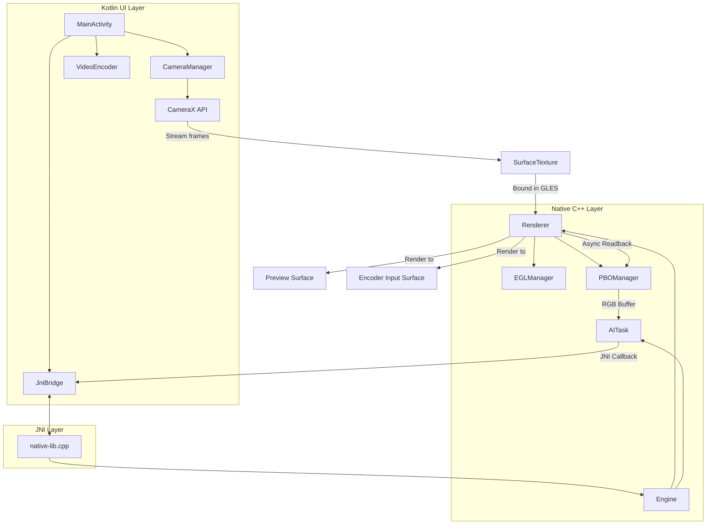
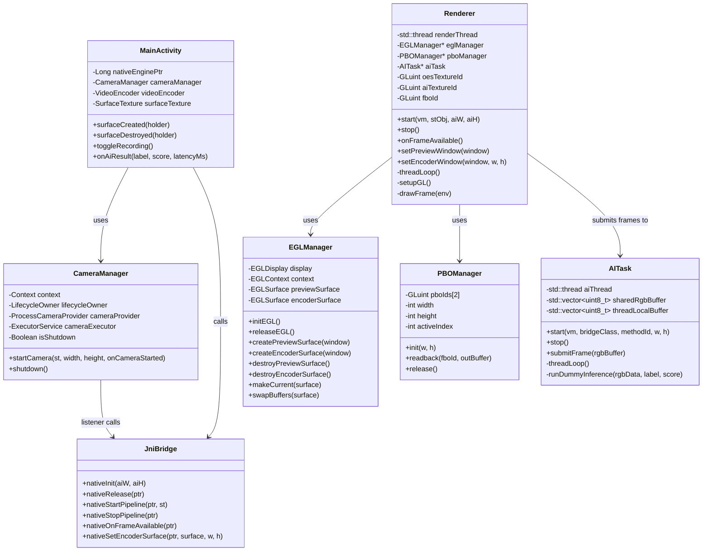
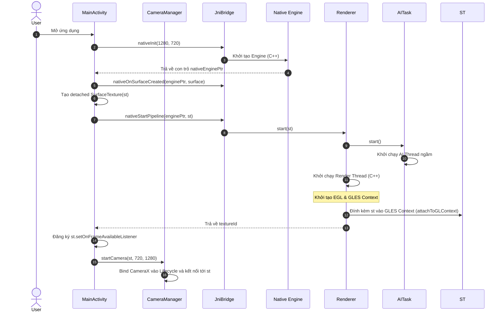
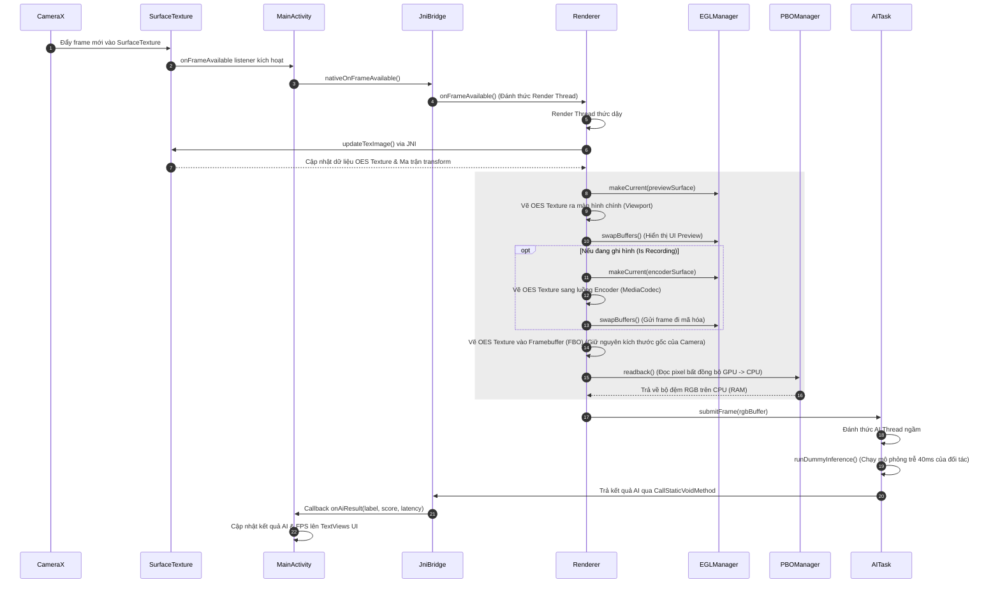

# GPU Camera Pipeline Architecture & UML Diagrams

Tài liệu này mô tả chi tiết kiến trúc hệ thống và luồng dữ liệu (Data Flow) của ứng dụng **GPU Camera Pipeline** giúp người đọc có thể nhanh chóng nắm bắt và thiết kế hệ thống.

---

## 1. Tổng quan kiến trúc hệ thống (System Architecture)

Dự án được phân chia thành **3 phân tầng chính**:
*   **Kotlin Layer (UI & Camera/Encoder)**: Quản lý vòng đời ứng dụng, giao diện UI, cấu hình CameraX và MediaCodec (Bộ mã hóa video).
*   **JNI Layer (JniBridge)**: Làm cầu nối truyền dẫn dữ liệu và lệnh điều khiển giữa Kotlin và C++.
*   **Native C++ Layer (Render & AI Engine)**: Thực hiện xử lý đồ họa GPU hiệu năng cao bằng OpenGL ES, đọc ngược bộ đệm (readback) bất đồng bộ qua PBO và chạy xử lý AI luồng nền.

---

## 2. Biểu đồ lớp (Class Diagram)

Mô tả mối quan hệ giữa các class trong cả Kotlin và C++:

---

## 3. Quy trình khởi tạo (Initialization Sequence)

Mô tả luồng các bước khởi chạy hệ thống khi ứng dụng mở ra và `surfaceCreated` của View chính được gọi:

---

## 4. Luồng xử lý Frame (Runtime Frame Loop Sequence)

Mô tả luồng đi của một frame ảnh từ lúc cảm biến camera bắt được cho tới khi hiển thị lên màn hình, lưu file MP4 và chạy model AI:

---

## 5. Tóm tắt vai trò các Component chính

1.  **`MainActivity`**: Điều phối vòng đời ứng dụng. Lắng nghe callback kết quả phân tích AI gửi về từ Native C++ để hiển thị lên màn hình và nút ghi video.
2.  **`CameraManager`**: Thiết lập camera bằng CameraX. Đưa luồng ảnh đầu ra vào một `SurfaceTexture` tuỳ chỉnh để chuyển quyền kiểm soát buffer cho OpenGL Native.
3.  **`VideoEncoder`**: Khởi tạo luồng mã hóa video qua `MediaCodec`. Cung cấp một `Surface` để C++ Renderer vẽ trực tiếp dữ liệu từ OpenGL vào.
4.  **`Renderer`**: Điểm trung chuyển chính. Luôn chạy trên một Render Thread riêng biệt. Nhiệm vụ của nó là vẽ frame camera nhận được lên màn hình preview, lên luồng ghi hình, và vẽ vào FBO để phục vụ AI (giữ nguyên kích thước gốc, tự động co dãn cấu trúc FBO/PBO khi đổi độ phân giải).
5.  **`EGLManager`**: Thiết lập và quản lý hạ tầng EGL (Context, Display, Surfaces) cần thiết để chạy OpenGL ES trên các luồng native C++ độc lập với luồng UI của Java.
6.  **`PBOManager`**: Tối ưu hóa hiệu năng đọc ngược dữ liệu hình ảnh (Read Pixels) bằng cách sử dụng cơ chế Double PBO. Giúp CPU không bị block chờ đợi GPU hoàn thành tác vụ vẽ, tăng đáng kể FPS.
7.  **`AITask`**: Thực hiện phân tích AI trên luồng ngầm riêng biệt giúp tránh gây giật lag luồng render chính của camera. Có cơ chế thay đổi kích thước bộ đệm động (`resize`) an toàn đa luồng.
